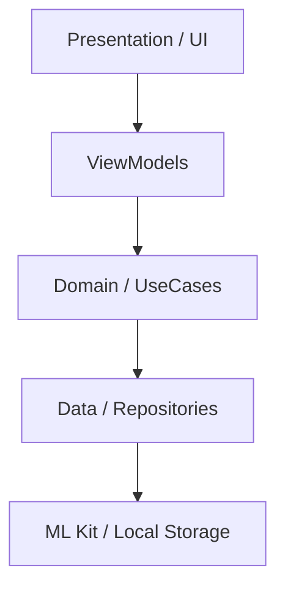

# Simple Document Scanner 📄✨

A high-performance, modern Android application built to simplify document scanning, processing, and sharing. Powered by **Google Play Services ML Kit**, this app provides a seamless professional scanning experience directly on your device.

---

## 🚀 Features

- **Inteligent Scanning**: Automatic document detection, perspective correction, and image enhancement using ML Kit.
- **Versatile Formats**: Export your documents as high-quality **PDFs** or **JPEG/PNG** images.
- **Material You Design**: A beautiful, dynamic interface that adapts to your device theme, built entirely with **Jetpack Compose**.
- **Effortless Sharing**: Integration with the native Android Share Sheet for quick delivery via email, cloud, or messaging.
- **Privacy First**: All document processing happens locally on your device.
- **Clean Architecture**: Built with scalability and maintainability in mind using Domain-Driven Design principles.

---

## 🛠️ Tech Stack

This project leverages the latest Android development technologies:

| Category          | Technology                                                                 |
|-------------------|---------------------------------------------------------------------------|
| **UI Framework**  | Jetpack Compose / Material 3 (Material You)                               |
| **Scanner Engine**| Google ML Kit Document Scanner API                                        |
| **DI Engine**     | Hilt (Dagger)                                                             |
| **Navigation**    | Compose Navigation                                                        |
| **Asynchronous**  | Kotlin Coroutines & Flow                                                   |
| **Image Loading** | Coil                                                                      |
| **Architecture**  | MVVM + Clean Architecture (Presentation, Domain, Data)                     |

---

## 🏛️ Architecture

The app follows **Clean Architecture** principles to ensure a decoupled and testable codebase:



- **Presentation**: UI components (Compose) and ViewModels.
- **Domain**: Business logic, UseCases, and Repository interfaces.
- **Data**: Implementation of repositories, local data sources, and ML Kit integrations.

---

## 📥 Getting Started

### Prerequisites

- Android Studio **Ladybug** or newer.
- Android SDK **35**.
- A device or emulator running **Android 7.0 (API 24)** or higher.

### Installation

1. Clone the repository:
   ```bash
   git clone https://github.com/CorsiDanilo/simple-document-scanner.git
   ```
2. Open the project in Android Studio.
3. Sync the project with Gradle files.
4. Build and run it on your device.

---

## 📸 Usage

1. **Scan**: Tap the scan button to launch the camera-based document scanner.
2. **Review**: The app will automatically detect document borders and allow manual cropping/adjustment.
3. **Format**: Choose your preferred output format (PDF or Image).
4. **Share**: Tap the share icon to send your document instantly.

---

## 📄 License

This project is licensed under the MIT License - see the [LICENSE](LICENSE) file for details.

---

<p align="center">
  Generated with ❤️ by <strong>Antigravity</strong>
</p>
