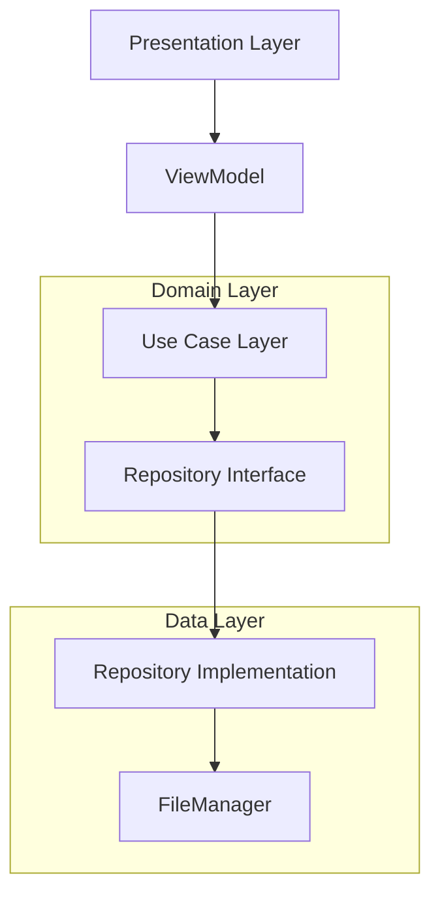

[⬅ Previous](./01-overview.md) | [🏠 Index](./README.md) | [Next ➡](./03-setup.md)

# Project Structure

The `simple-document-scanner` project follows a modular Clean Architecture pattern, separating concerns into distinct layers: **Presentation**, **Domain**, **Data**, and **Core**. This structure ensures testability, maintainability, and clear separation between business logic and UI implementation.

## Directory Tree

```
simple-document-scanner/
├── .github/
│   └── workflows/
│       └── release.yml
├── app/
│   ├── src/
│   │   └── main/
│   │       ├── java/
│   │       │   └── com/
│   │       │       └── anomalyzed/
│   │       │           └── docscanner/
│   │       │               ├── core/
│   │       │               ├── data/
│   │       │               ├── domain/
│   │       │               └── presentation/
│   │       ├── res/
│   │       └── AndroidManifest.xml
│   └── build.gradle.kts
├── assets/
├── gradle/
├── .gitignore
├── build.gradle.kts
├── CHANGELOG.md
├── gradle.properties
├── gradlew
├── LICENSE
├── README.md
└── settings.gradle.kts
```

## Logical Architecture

The codebase is organized into four primary layers within `com.anomalyzed.docscanner`:

| Layer | Path | Responsibility |
| :--- | :--- | :--- |
| **Presentation** | `presentation/` | UI components (Jetpack Compose), ViewModels, and Navigation logic. |
| **Domain** | `domain/` | Business logic, UseCases, Repository interfaces, and Data models. |
| **Data** | `data/` | Implementation of repositories and low-level storage/file management. |
| **Core** | `core/` | Dependency Injection (Hilt) modules, shared utilities, and extensions. |

### Architecture Diagram



## Key Components

### Presentation Layer
*   **`presentation/MainActivity.kt`**: The entry point of the application. It initializes the `DocScannerNavGraph` and sets up the theme.
*   **`presentation/navigation/NavGraph.kt`**: Defines the navigation routes (`Home`, `Scans`, `Result`) and handles screen transitions.
*   **`presentation/scanner/ScannerViewModel.kt`**: Manages the state of the document scanning process, interacting with `SaveDocumentUseCase` and `ShareDocumentUseCase`.
*   **`presentation/theme/Theme.kt`**: Defines the `SimpleDocumentScannerTheme`, managing color schemes and dynamic color support.

### Domain Layer
*   **`domain/model/ScannedDocument.kt`**: The core data model representing a scanned document, including metadata and URI references.
*   **`domain/repository/IDocumentRepository.kt`**: The interface defining the contract for document operations (save, delete, rename, retrieve).
*   **`domain/usecase/SaveDocumentUseCase.kt`**: Encapsulates the business logic for saving PDF and image documents to storage.
*   **`domain/usecase/ShareDocumentUseCase.kt`**: Handles the logic for sharing documents via system intents.

### Data Layer
*   **`data/repository/DocumentRepositoryImpl.kt`**: The concrete implementation of `IDocumentRepository`. It coordinates with `FileManager` to persist data.
*   **`data/storage/FileManager.kt`**: Handles low-level file I/O operations, including saving streams to the file system and generating shareable `FileProvider` URIs.

### Core Layer
*   **`core/di/AppModule.kt`**: Provides singleton instances, such as the application `Context`.
*   **`core/di/RepositoryModule.kt`**: Configures Hilt bindings to inject `DocumentRepositoryImpl` whenever `IDocumentRepository` is requested.
*   **`core/utils/BitmapUtils.kt`**: Contains helper functions for image processing, such as downsampling bitmaps and applying image filters.
*   **`DocScannerApp.kt`**: The custom `Application` class annotated with `@HiltAndroidApp`, serving as the root for dependency injection.

[⬅ Previous](./01-overview.md) | [🏠 Index](./README.md) | [Next ➡](./03-setup.md)