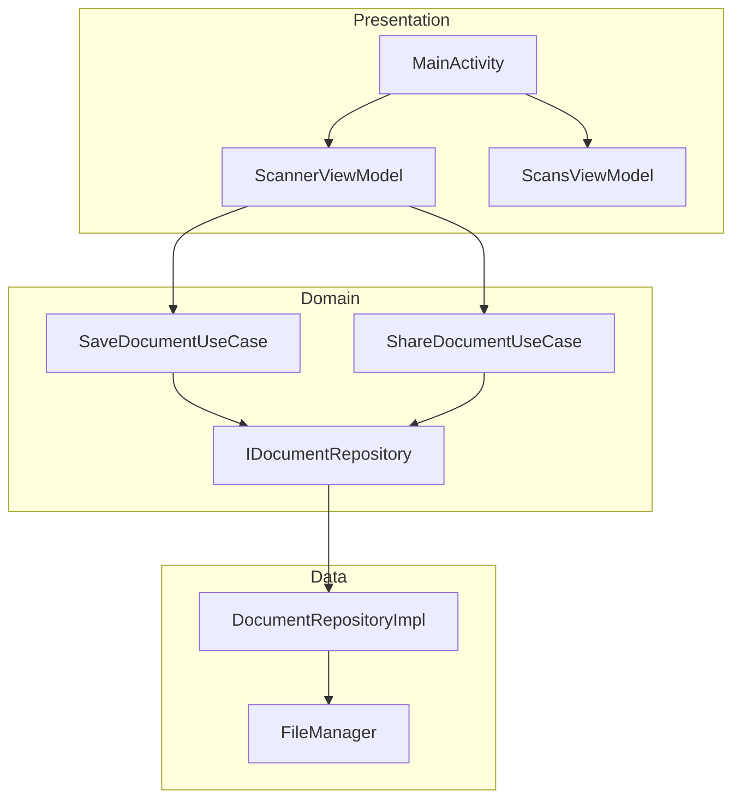

[⬅ Previous](./02-structure.md) | [🏠 Index](./README.md) | [Next ➡](./04-deployment.md)

# Local Development Setup: simple-document-scanner

This guide provides instructions for setting up the `simple-document-scanner` Android project on a local development machine.

## 1. Prerequisites

Ensure your development environment meets the following requirements before attempting to build the project:

| Requirement | Version/Details |
| :--- | :--- |
| **JDK** | OpenJDK 17 (Zulu distribution recommended) |
| **Android Studio** | Latest Stable Version (e.g., Jellyfish or newer) |
| **Android SDK** | SDK Platform 35 (Android 15) |
| **Build Tools** | 35.0.0 |
| **Git** | Latest version |

## 2. Clone and Setup

1.  **Clone the repository:**
    ```bash
    git clone <repository-url>
    cd simple-document-scanner
    ```

2.  **Configure Gradle Wrapper:**
    The project includes a Gradle wrapper. Ensure it has execution permissions:
    ```bash
    chmod +x gradlew
    ```

3.  **Sync Project:**
    Open the project root directory in Android Studio. The IDE will automatically detect the `build.gradle.kts` files and initiate a Gradle sync.

## 3. Environment Configuration

The project does not require external API keys or sensitive environment variables for core functionality. However, you must configure your local SDK path.

1.  Create a `local.properties` file in the project root directory if it does not exist.
2.  Add your Android SDK path:
    ```properties
    sdk.dir=/Users/<your-username>/Library/Android/sdk
    ```
    *(On Windows, use `C:\\Users\\<your-username>\\AppData\\Local\\Android\\Sdk`)*

## 4. Architecture Overview

The project follows a clean architecture pattern, separating concerns into distinct layers.



## 5. Running the Application

### Using Android Studio
1.  Connect an Android device or start an Emulator (API 33+ recommended).
2.  Select the `app` module in the run configuration dropdown.
3.  Click the **Run** (green play) button.

### Using Command Line
To build and install the debug APK directly to a connected device:

```bash
./gradlew :app:installDebug
```

To build the APK without installing:

```bash
./gradlew :app:assembleDebug
```

## 6. Running Tests

The project utilizes standard JUnit and Android instrumentation tests.

### Unit Tests
Run unit tests located in `app/src/test`:
```bash
./gradlew :app:testDebugUnitTest
```

### Instrumentation Tests
Run instrumentation tests located in `app/src/androidTest` (requires a connected device or emulator):
```bash
./gradlew :app:connectedDebugAndroidTest
```

## 7. Troubleshooting

### Gradle Sync Failures
If the project fails to sync, ensure your `gradle/libs.versions.toml` file is intact and that you have a stable internet connection to download dependencies.
*   **Action:** In Android Studio, go to **File > Sync Project with Gradle Files**.
*   **Action:** If issues persist, run `./gradlew clean` from the terminal.

### SDK Path Issues
If the build fails with "SDK location not found," verify the `local.properties` file created in Section 3. Ensure the path points to the directory containing the `platforms` and `build-tools` folders.

### Missing Permissions
The application requires camera and storage permissions. If the scanner fails to launch:
1.  Go to **Settings > Apps > simple-document-scanner > Permissions**.
2.  Ensure **Camera** and **Files and Media** permissions are granted.

### Build Tools Version Mismatch
The project is configured to use Build Tools `35.0.0`. If you receive a version mismatch error:
1.  Open `app/build.gradle.kts`.
2.  Verify the `android { buildToolsVersion = "35.0.0" }` block.
3.  Ensure the corresponding SDK version is installed via the Android Studio SDK Manager.

[⬅ Previous](./02-structure.md) | [🏠 Index](./README.md) | [Next ➡](./04-deployment.md)