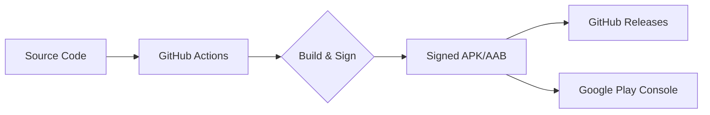

[⬅ Previous](./03-setup.md) | [🏠 Index](./README.md) | [Next ➡](./05-image-processing-pipeline.md)

# Deployment & CI/CD

This document outlines the deployment architecture, CI/CD pipeline, environment management, and maintenance procedures for the `simple-document-scanner` Android application.

## Deployment Architecture

The application follows a standard Android client-side deployment model. The build process generates signed APKs or Android App Bundles (AAB) via GitHub Actions, which are then distributed through GitHub Releases or the Google Play Console.



## CI/CD Pipeline

The project utilizes GitHub Actions for continuous integration and delivery. The workflow is defined in `.github/workflows/release.yml` and triggers automatically upon pushing a version tag (e.g., `v1.0.0`).

### Pipeline Stages

1.  **Checkout Code**: Clones the repository to the runner environment.
2.  **Setup Environment**: Configures JDK 17 (Zulu distribution) and caches Gradle dependencies to optimize build times.
3.  **Build**: Executes `./gradlew assembleRelease` to compile the Kotlin source code and generate the unsigned APK.
4.  **Sign**: Uses the `r0adkll/sign-android-release` action to apply the release keystore to the APK.
5.  **Upload**: Publishes the signed artifact to the GitHub Releases page using `softprops/action-gh-release`.

### Required Secrets

To enable the signing process in the CI/CD pipeline, the following secrets must be configured in the GitHub repository settings:

| Secret Name | Description |
| :--- | :--- |
| `SIGNING_KEY` | Base64 encoded JKS keystore file. |
| `ALIAS` | The alias of the key within the keystore. |
| `KEY_STORE_PASSWORD` | Password for the keystore file. |
| `KEY_PASSWORD` | Password for the specific key alias. |

## Environment Configuration

The project manages environment-specific configurations using Gradle build types defined in `app/build.gradle.kts`.

### Build Types

*   **Debug**: Used for local development. Includes debug symbols, enables `applicationIdSuffix` (e.g., `.debug`), and allows for easier debugging via Android Studio.
*   **Release**: Used for production distribution. Enables code shrinking (R8/ProGuard) to reduce APK size and obfuscate code.

### Configuration Management

Environment-specific variables (such as API endpoints or feature flags) should be managed via `buildConfigField` in the `app/build.gradle.kts` file:

```kotlin
android {
    buildTypes {
        getByName("release") {
            isMinifyEnabled = true
            proguardFiles(getDefaultProguardFile("proguard-android-optimize.txt"), "proguard-rules.pro")
            buildConfigField("String", "BASE_URL", "\"https://api.production.com\"")
        }
        getByName("debug") {
            buildConfigField("String", "BASE_URL", "\"https://api.staging.com\"")
        }
    }
}
```

## Monitoring and Logging

The application implements error handling and state management to monitor runtime health.

### Error Handling
The application uses `ScannerViewModel` and `ScansViewModel` to capture and report errors to the UI. The `ScannerUiState` sealed class handles error states:

```kotlin
sealed class ScannerUiState {
    // ...
    data class Error(val message: String) : ScannerUiState()
}
```

### Logging
*   **Development**: Use `Logcat` in Android Studio to monitor application logs.
*   **Production**: It is recommended to integrate Firebase Crashlytics to capture non-fatal exceptions and crashes in the field. Ensure the `google-services.json` file is placed in the `app/` directory if Crashlytics is enabled.

## Rollback Procedures

In the event of a critical failure in a production release, follow these procedures:

### GitHub Releases Rollback
1.  Navigate to the **Releases** tab in the GitHub repository.
2.  Identify the previous stable release tag.
3.  If a hotfix is required, create a new branch from the previous stable tag, apply the necessary fixes, and push a new version tag (e.g., `v1.0.1`).

### Google Play Store Rollback
1.  Navigate to the **Google Play Console**.
2.  Select the application and navigate to **App Bundle Explorer**.
3.  Select the previous version of the App Bundle that was stable.
4.  Click **Promote release** and select the **Production** track to overwrite the faulty version.

---

### Why included

**Reason:** Architecture 'other' recommends this section

**Confidence:** 50%


> ⚠️ **Low confidence** — This section may need manual review.

[⬅ Previous](./03-setup.md) | [🏠 Index](./README.md) | [Next ➡](./05-image-processing-pipeline.md)