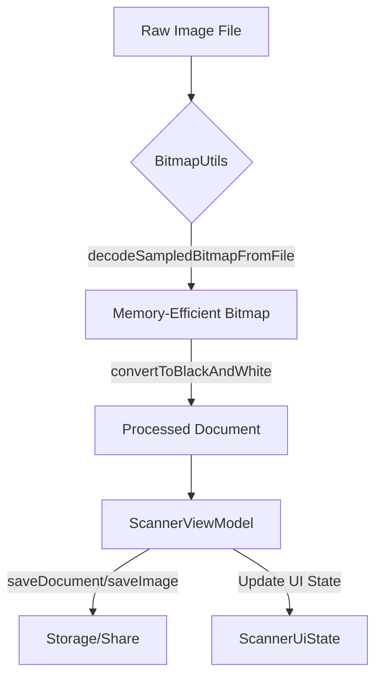

[⬅ Previous](./04-deployment.md) | [🏠 Index](./README.md) | [Next ➡](./06-data-persistence-strategy.md)

# Image Processing Pipeline

The image processing pipeline in the `simple-document-scanner` application is designed to handle high-resolution document captures while maintaining memory efficiency and providing consistent visual output. The pipeline manages the lifecycle of an image from raw file decoding to high-contrast document conversion, orchestrated by the application's state management layer.

## Architecture Overview

The pipeline operates through a separation of concerns:
1.  **Utility Layer (`BitmapUtils`):** Handles low-level bitmap decoding, memory optimization, and image filtering.
2.  **Orchestration Layer (`ScannerViewModel`):** Manages the asynchronous execution of document processing tasks and updates the UI state accordingly.



## Bitmap Manipulation

The `com.anomalyzed.docscanner.core.utils.BitmapUtils` object provides the core logic for processing images. It prioritizes memory management to prevent `OutOfMemoryError` exceptions when handling large camera captures.

### Memory-Efficient Decoding

The `decodeSampledBitmapFromFile` function implements sub-sampling. By decoding the image bounds first, the application calculates an `inSampleSize` that scales the image down to the required dimensions before loading it into memory.

**Function Signature:**
```kotlin
fun decodeSampledBitmapFromFile(file: File, reqWidth: Int, reqHeight: Int): Bitmap?
```

| Parameter | Description |
| :--- | :--- |
| `file` | The source `java.io.File` containing the image. |
| `reqWidth` | The target width in pixels. |
| `reqHeight` | The target height in pixels. |

### Image Filtering

The `convertToBlackAndWhite` function transforms full-color images into high-contrast black and white documents. This is achieved by applying a `ColorMatrix` to the bitmap canvas, which is ideal for text-heavy documents.

```kotlin
// Example usage of BitmapUtils
val originalBitmap = BitmapUtils.decodeSampledBitmapFromFile(imageFile, 1080, 1920)
val processedBitmap = originalBitmap?.let { 
    BitmapUtils.convertToBlackAndWhite(it) 
}
```

## State Management

The `com.anomalyzed.docscanner.presentation.scanner.ScannerViewModel` acts as the controller for the pipeline. It exposes a `StateFlow` that the UI observes to react to processing events.

### ScannerUiState

The pipeline uses a sealed class to represent the current status of the document processing operation:

*   `ScannerUiState.Idle`: The initial state, waiting for user input.
*   `ScannerUiState.Processing`: Indicates that a save or conversion operation is currently running.
*   `ScannerUiState.Success`: The operation completed successfully.
*   `ScannerUiState.Error`: An error occurred during processing (e.g., file I/O failure).

### Processing Workflow

When a user triggers a save operation, the `ScannerViewModel` launches a coroutine within the `viewModelScope`. This ensures that the processing does not block the main thread and is automatically cancelled if the ViewModel is cleared.

```kotlin
fun saveDocument(pdfUri: Uri, title: String? = null) {
    viewModelScope.launch {
        _uiState.value = ScannerUiState.Processing
        val result = saveDocumentUseCase.savePdf(pdfUri, title)
        result.onSuccess {
            _uiState.value = ScannerUiState.Success("File saved successfully")
        }.onFailure {
            _uiState.value = ScannerUiState.Error("Error saving file: ${it.localizedMessage}")
        }
    }
}
```

## Troubleshooting and Best Practices

### Memory Optimization
The pipeline explicitly uses `Bitmap.Config.RGB_565` during decoding. This configuration uses 2 bytes per pixel instead of the standard 4 bytes (`ARGB_8888`), effectively halving the memory footprint of the bitmap. If you encounter visual artifacts in gradients, consider reverting to `ARGB_8888`, but monitor memory usage closely.

### Threading
All heavy lifting, such as `BitmapUtils` operations and `saveDocumentUseCase` calls, must be performed off the main thread. The `ScannerViewModel` handles this via `viewModelScope.launch`. Do not call `BitmapUtils` functions directly from a Composable function or the main thread, as this will cause UI jank.

### Error Handling
Always ensure that the `ScannerUiState.Error` state is handled in the UI layer. The `ScannerViewModel` provides the `handleError(message: String)` function to manually trigger error states if validation fails before the use case is invoked.

---

### Why included

**Reason:** The core functionality of a document scanner relies heavily on image processing. Documenting the transformation pipeline (capture -> bitmap processing -> storage) is critical for maintainers.

**Confidence:** 70%


> ⚠️ **Low confidence** — This section may need manual review.


**Evidence:**

- `com.anomalyzed.docscanner.core.utils.BitmapUtils`: com.anomalyzed.docscanner.core.utils.BitmapUtils

- `ScannerViewModel.kt`: ScannerViewModel.kt

[⬅ Previous](./04-deployment.md) | [🏠 Index](./README.md) | [Next ➡](./06-data-persistence-strategy.md)