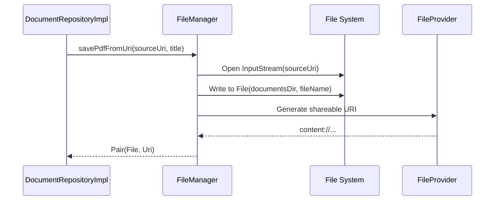

[⬅ Previous](./05-image-processing-pipeline.md) | [🏠 Index](./README.md) | [Next ➡](./07-domain-layer-logic.md)

# Data Persistence Strategy

The `simple-document-scanner` application employs a file-based persistence strategy to manage scanned documents. This approach ensures that documents are stored securely within the application's private storage while remaining accessible to other applications via Android's `FileProvider` mechanism.

## Architecture Overview

The persistence layer is divided into two primary components:

1.  **`FileManager`**: A low-level utility class responsible for raw I/O operations, directory management, and generating shareable URIs.
2.  **`DocumentRepositoryImpl`**: A domain-layer implementation that orchestrates the persistence flow, mapping domain models (`ScannedDocument`) to physical file operations.

### Persistence Flow

The following diagram illustrates the interaction between the repository and the file manager when saving a document:



## Directory Structure

The application utilizes external storage directories to ensure compatibility with system file managers while maintaining application-specific isolation.

| File Type | Directory Path | Fallback Path |
| :--- | :--- | :--- |
| **PDF Documents** | `getExternalFilesDir(Environment.DIRECTORY_DOCUMENTS)` | `context.filesDir` |
| **Images (JPEG)** | `getExternalFilesDir(Environment.DIRECTORY_PICTURES)` | `context.filesDir` |

## Naming Conventions

To ensure file system compatibility and prevent naming collisions, the `FileManager` applies specific sanitization and generation rules:

1.  **Sanitization**: All user-provided titles are processed to remove illegal characters using the regex `[^a-zA-Z0-9._\- ]`, replacing them with underscores (`_`).
2.  **PDF Files**: If a title is provided, it is appended with `.pdf` if missing. If no title is provided, `generateFileName("PDF")` is invoked.
3.  **Image Files**: If multiple images are saved (e.g., a multi-page scan), an index suffix is appended (e.g., `_1`, `_2`) to the sanitized title.

## Component Details

### FileManager
Located at `app/src/main/java/com/anomalyzed/docscanner/data/storage/FileManager.kt`, this class handles the physical writing of bytes to the disk.

| Method | Description |
| :--- | :--- |
| `savePdfFromUri(Uri, String?)` | Copies a PDF from a source URI to the app's document directory. |
| `saveImageFromUri(Uri, String?)` | Copies an image from a source URI to the app's picture directory. |
| `getShareableUri(Uri)` | Converts a file URI to a `content://` URI via `FileProvider`. |

### DocumentRepositoryImpl
Located at `app/src/main/java/com/anomalyzed/docscanner/data/repository/DocumentRepositoryImpl.kt`, this class acts as the bridge between the UI/Domain layer and the `FileManager`.

```kotlin
// Example: Saving a PDF via DocumentRepositoryImpl
override suspend fun savePdfToStorage(sourceUri: Uri, title: String?): ScannedDocument = withContext(Dispatchers.IO) {
    val (file, shareableUri) = fileManager.savePdfFromUri(sourceUri, title)
    ScannedDocument(
        id = file.absolutePath,
        title = file.nameWithoutExtension,
        imageUri = null,
        pdfUri = shareableUri,
        timestamp = System.currentTimeMillis(),
        format = DocumentFormat.PDF
    )
}
```

## Implementation Details

### FileProvider Configuration
The `FileManager` relies on `FileProvider` to expose files to external applications. The authority used is defined as:

```kotlin
val shareableUri = FileProvider.getUriForFile(
    context,
    "${context.packageName}.fileprovider",
    destinationFile
)
```

Ensure that `AndroidManifest.xml` contains the corresponding provider definition with the `android:authorities` attribute set to `${applicationId}.fileprovider` to match the `FileManager` implementation.

## Troubleshooting

*   **Permission Denied**: Ensure the application has `WRITE_EXTERNAL_STORAGE` permissions if targeting older Android versions, though `getExternalFilesDir` generally does not require runtime permissions on Android 10+ (API 29+).
*   **File Not Found**: If `openInputStream` fails, verify that the `sourceUri` has valid read permissions granted by the calling intent or system picker.
*   **Sanitization Issues**: If files are not appearing with the expected names, verify that the `title` passed to `savePdfFromUri` does not contain characters blocked by the `[^a-zA-Z0-9._\- ]` regex.

---

### Why included

**Reason:** The app manages local file storage for documents. Understanding the persistence layer is essential for debugging file access issues or implementing backup/restore features.

**Confidence:** 70%


> ⚠️ **Low confidence** — This section may need manual review.


**Evidence:**

- `FileManager.kt`: FileManager.kt

- `DocumentRepositoryImpl.kt`: DocumentRepositoryImpl.kt

[⬅ Previous](./05-image-processing-pipeline.md) | [🏠 Index](./README.md) | [Next ➡](./07-domain-layer-logic.md)