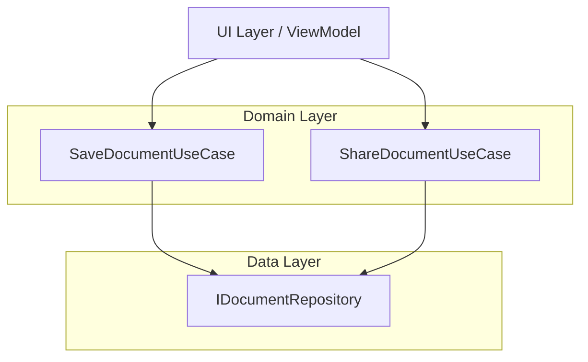
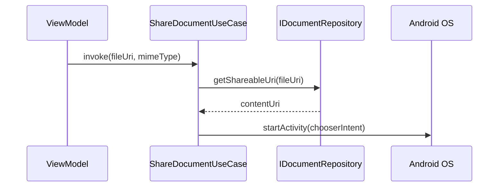

[⬅ Previous](./06-data-persistence-strategy.md) | [🏠 Index](./README.md)

# Domain Layer Logic

The Domain Layer acts as the central business logic hub for the `simple-document-scanner` application. It encapsulates the core operations required to manage document lifecycles, specifically focusing on persistence (saving) and distribution (sharing). By isolating these rules from the UI and Data layers, the application ensures that business logic remains testable, reusable, and independent of Android framework specifics.

## Architecture Overview

The Domain Layer utilizes the Use Case pattern (also known as Interactors). Each class represents a single, distinct business operation. These use cases interact with the `IDocumentRepository` interface, which abstracts the underlying data storage mechanisms (e.g., file system, database).



## Document Persistence

The `SaveDocumentUseCase` handles the orchestration of saving scanned assets to the device's persistent storage. It leverages Kotlin Coroutines to ensure that I/O operations do not block the main thread.

### Class: `SaveDocumentUseCase`

Located at `app/src/main/java/com/anomalyzed/docscanner/domain/usecase/SaveDocumentUseCase.kt`, this class provides three primary entry points for saving different types of document assets.

| Function | Description | Return Type |
| :--- | :--- | :--- |
| `savePdf(Uri, String?)` | Persists a single PDF document to storage. | `Result<ScannedDocument>` |
| `saveImages(List<Uri>, String?)` | Persists a collection of image assets. | `Result<List<ScannedDocument>>` |
| `saveBoth(Uri, List<Uri>, String?)` | Persists both a PDF and associated images. | `Result<List<ScannedDocument>>` |

#### Implementation Example

```kotlin
// Example usage within a ViewModel
val result = saveDocumentUseCase.savePdf(sourceUri, "Invoice_October")

result.onSuccess { document ->
    // Handle successful save
}.onFailure { error ->
    // Handle error
}
```

## Document Sharing

The `ShareDocumentUseCase` manages the workflow for exporting documents to external applications. It handles URI permission management and intent creation to ensure that external apps can securely access the shared files.

### Class: `ShareDocumentUseCase`

Located at `app/src/main/java/com/anomalyzed/docscanner/domain/usecase/ShareDocumentUseCase.kt`, this class abstracts the complexity of Android's `Intent` system.

#### Workflow Logic

1.  **URI Validation**: Checks if the provided URI is a `content://` scheme.
2.  **Permission Handling**: If the URI is a local file, it requests a shareable URI from the `IDocumentRepository` (typically via `FileProvider`).
3.  **Intent Construction**: Creates an `ACTION_SEND` intent with the appropriate MIME type.
4.  **Execution**: Launches the system chooser to allow the user to select a target application.



#### Function Signature

```kotlin
fun invoke(fileUri: Uri, mimeType: String = "application/pdf")
```

| Parameter | Type | Default | Description |
| :--- | :--- | :--- | :--- |
| `fileUri` | `Uri` | N/A | The URI of the document to share. |
| `mimeType` | `String` | `"application/pdf"` | The MIME type for the intent filter. |

## Troubleshooting

### URI Permission Errors
If sharing fails with a `SecurityException`, ensure that the `IDocumentRepository` implementation correctly grants read permissions. The `ShareDocumentUseCase` automatically adds `Intent.FLAG_GRANT_READ_URI_PERMISSION` to the intent, but the underlying `FileProvider` must be configured in `AndroidManifest.xml` to allow access to the specific file paths.

### Threading
All methods in `SaveDocumentUseCase` are marked with `suspend` and explicitly switch to `Dispatchers.IO`. Ensure that callers are within a `CoroutineScope` (e.g., `viewModelScope`) to avoid blocking the UI thread during file system operations.

---

### Why included

**Reason:** The project uses a clean architecture approach with explicit use cases. Documenting these ensures that business logic remains decoupled from the UI and data layers.

**Confidence:** 70%


> ⚠️ **Low confidence** — This section may need manual review.


**Evidence:**

- `SaveDocumentUseCase.kt`: SaveDocumentUseCase.kt

- `ShareDocumentUseCase.kt`: ShareDocumentUseCase.kt

[⬅ Previous](./06-data-persistence-strategy.md) | [🏠 Index](./README.md)